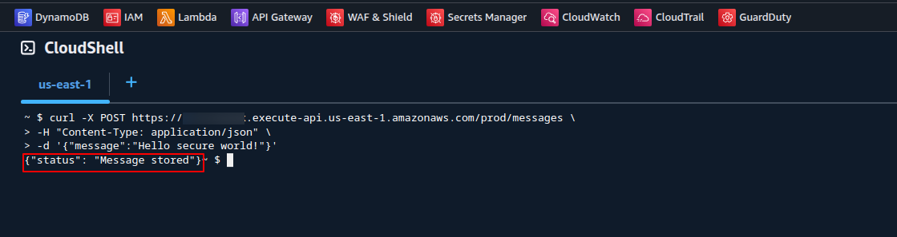

# Secure Serverless Message Board

This project demonstrates a secure, serverless web app on AWS with layered security.

## 🚀 Overview

- **Frontend/API:** API Gateway + Lambda
- **Database:** DynamoDB
- **Security Layers:** WAF, IAM, GuardDuty, CloudTrail, Secrets Manager
- **Logging & Monitoring:** CloudWatch

## 📌 Features

- Submit and retrieve messages via REST API
- AWS WAF blocks common threats (XSS, SQLi)
- Fine-grained IAM permissions
- All activity logged via CloudTrail
- Threat detection via GuardDuty

## 🧰 Technologies

| Layer           | Service Used                         |
|----------------|---------------------------------------|
| API            | API Gateway                          |
| Backend        | AWS Lambda (Node.js)                 |
| Database       | DynamoDB                             |
| Security       | WAF, IAM, GuardDuty, Secrets Manager |
| Monitoring     | CloudWatch, CloudTrail               |

## 🛠️ Architecture


## 📂 Folder Structure

| Folder        | Description                            |
|---------------|----------------------------------------|
| `lambda/`     | Lambda function code                   |
| `iam/`        | IAM policy for Lambda                  |
| `waf/`        | WAF WebACL setup                       |
| `images/`     | Screenshots of demo, WAF logs          |
| `cloudtrail/` | (Optional) Sample logs                 |
| `guardduty/`  | (Optional) Simulated findings          |

## 🧪 Screenshots

### ✅ Clean request (stored):


### ❌ XSS attack (blocked):


### 🔒 WAF Log:


## ✅ Example API Call

```bash
curl -X POST https://your-api-url.amazonaws.com/prod/messages \
  -H "Content-Type: application/json" \
  -d '{"message": "Hello secure world!"}'

