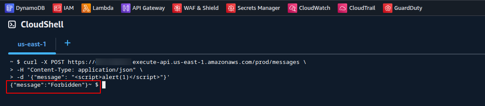
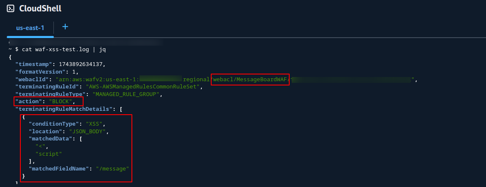
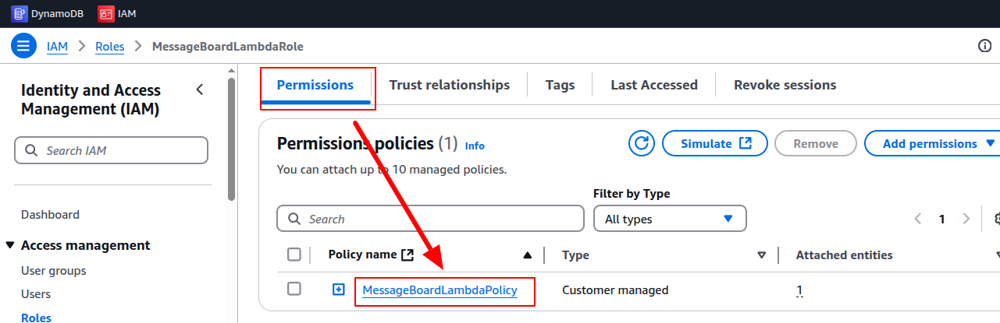
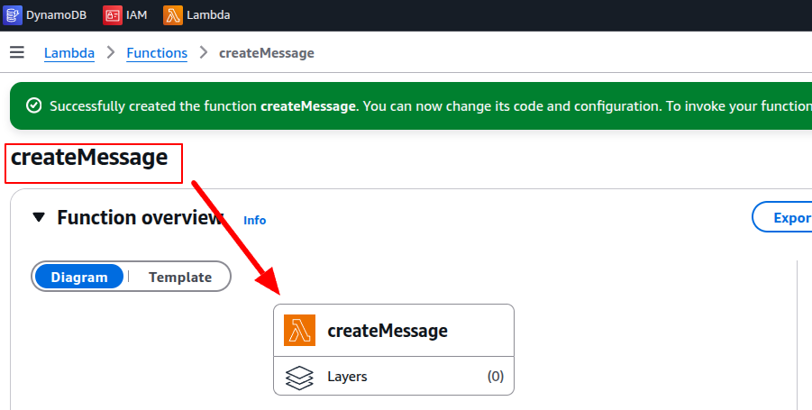
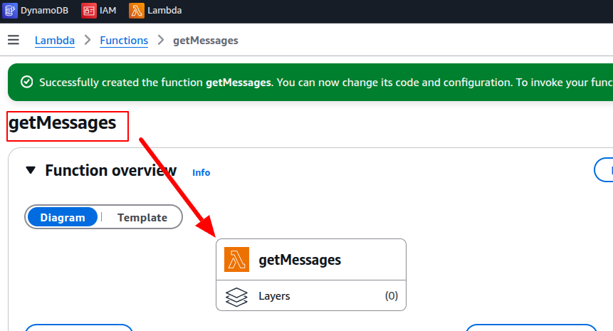
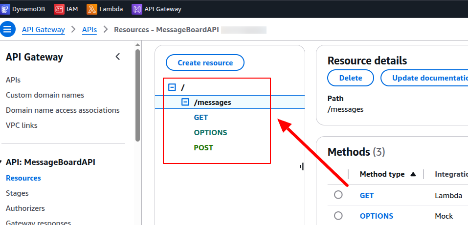
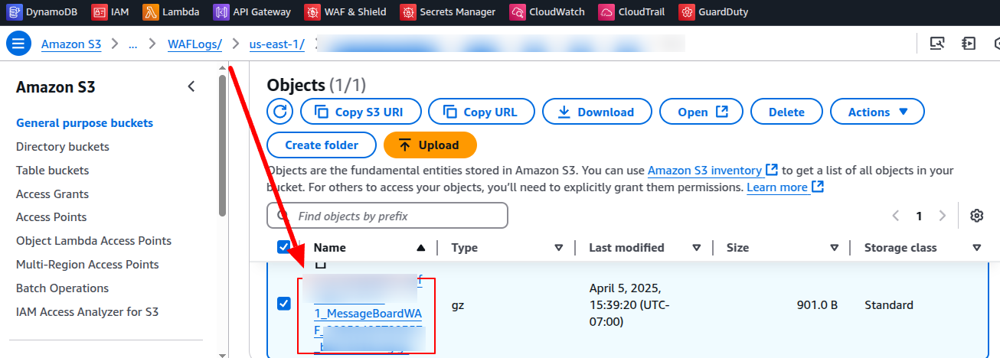

# Secure Serverless Message Board (AWS)

This project showcases a secure, serverless REST API built using core AWS services with a strong emphasis on identity, monitoring, logging, and protection against common web threats. It was created in a Pluralsight AWS sandbox environment for hands-on practice and cloud security portfolio development.

---

## Summary

The application allows users to submit and retrieve messages using a RESTful API. These messages are stored in DynamoDB and protected by a layered architecture involving WAF, IAM, CloudTrail, GuardDuty, and more. The infrastructure was manually deployed using the AWS Console.

---

## Services Used

- **Amazon API Gateway** – Entry point for the REST API
- **AWS Lambda** – Serverless compute to process messages
- **Amazon DynamoDB** – NoSQL storage for messages
- **AWS WAF** – Protects API from XSS, SQLi, and bad inputs
- **IAM** – Least privilege role for Lambda execution
- **Amazon CloudWatch** – Logs and alarms
- **AWS CloudTrail** – Account activity auditing
- **Amazon GuardDuty** – Threat detection and monitoring

---

## Key Project Files

- [`lambda/createMessage.py`](lambda/createMessage.py)
- [`lambda/getMessages.py`](lambda/getMessages.py)
- IAM role policy [`lambda-execution-policy.json`](iam/lambda-execution-policy.json)
- Policy attached to: `MessageBoardLambdaRole`

---

## Highlights

### ✅ AWS WAF Blocking XSS Attempt





---

## Additional Screenshots

| Step | Screenshot |
|------|------------|
| IAM Role Setup |  |
| Lambda Configuration |  |
| API Gateway Integration |  |
| CloudTrail Audit Log |  |

---

## Testing Examples

### Submit a message:
```bash
curl -X POST https://<api-id>.execute-api.<region>.amazonaws.com/prod/messages \
-H "Content-Type: application/json" \
-d '{"message":"Hello secure world!"}'
```

### Retrieve messages:
```bash
curl https://<api-id>.execute-api.<region>.amazonaws.com/prod/messages
```

### Simulate XSS Attack (Blocked by WAF):
```json
{ "message": "<script>alert('xss')</script>" }
```

---

## What I Learned

- How to apply **least privilege IAM** principles using roles and policies
- Setting up and integrating **API Gateway**, **Lambda**, and **DynamoDB**
- Using **AWS WAF** to mitigate common web attacks like XSS and SQL injection
- Enabling **monitoring** with CloudWatch and alert creation
- Logging and tracking user activity with **CloudTrail**
- Activating and reviewing **GuardDuty** for real-time threat intel
- Simulating attacks and verifying block results via logs and dashboards
- Structuring a complete AWS security project for a real-world portfolio

---

## Outcome

This project demonstrates how to build and secure a cloud-native, serverless API using AWS tools and services. It reflects security-first design thinking and operational awareness for logging, access control, and monitoring.

---
